# HTTP-Server

一个基于 C++ 和 Reactor 模型实现的 Linux 高并发静态资源 HTTP 服务器。项目使用非阻塞 Socket、I/O 多路复用、工作线程池和 `sendfile` 零拷贝发送文件，并提供异步 MySQL 访问日志、数据库工作线程和可动态扩缩的连接池。

## 功能特性

- Reactor 事件驱动模型
- 非阻塞 Socket 与 `accept4`
- Select、Poll、Epoll 调度器实现
- HTTP 工作线程池
- HTTP/1.0、HTTP/1.1 请求解析
- GET 静态文件访问与目录列表
- 400、404 响应处理
- `sendfile` 零拷贝文件传输
- 客户端 IPv4 地址采集
- 异步访问日志队列
- 多数据库工作线程并发写入
- MySQL 长连接池、连接健康检查和空闲回收
- 自动创建访问日志表

## 整体架构

```mermaid
flowchart LR
    Client["HTTP Client"] --> MainLoop["Main EventLoop"]
    MainLoop --> Accept["accept4"]
    Accept --> WorkerPool["HTTP ThreadPool"]
    WorkerPool --> Request["HttpRequest"]
    Request --> Response["HttpResponse"]
    Response --> Send["Buffer / sendfile"]
    Send --> LogQueue["AccessRecord Queue"]
    LogQueue --> DBWorkers["Database Workers"]
    DBWorkers --> ConnPool["ConnectionPool"]
    ConnPool --> MySQL[("MySQL")]
```



服务器主线程负责监听新连接，HTTP 工作线程负责解析请求和发送响应。访问记录只会被放入内存队列，真正的 MySQL 操作由独立数据库线程完成，因此数据库延迟不会直接阻塞 HTTP 工作线程。

## 请求处理流程

```text
客户端建立连接
  -> TcpServer 接收连接并获取客户端 IP
  -> ThreadPool 分配工作 EventLoop
  -> TcpConnection 读取数据
  -> HttpRequest 解析请求行和请求头
  -> HttpResponse 构造响应
  -> Buffer 发送响应头
  -> sendfile 发送普通文件
  -> 生成 AccessRecord
  -> DatabaseLogger::submit() 放入队列
  -> 数据库工作线程从连接池获取连接
  -> INSERT http_access_log
  -> 连接自动归还连接池
```

## 项目结构

```text
HTTP-Server/
├── HTTP-Server.sln
└── HTTP-Server/
    ├── main.cpp                 # 程序入口和运行配置
    ├── TcpServer.*              # 监听、接收客户端连接
    ├── TcpConnection.*          # 单个客户端连接和请求生命周期
    ├── EventLoop.*              # Reactor 事件循环
    ├── Channel.*                # 文件描述符及事件回调
    ├── Dispatcher.*             # I/O 多路复用抽象
    ├── EpollDispatcher.*        # Epoll 实现
    ├── PollDispatcher.*         # Poll 实现
    ├── SelectDispatcher.*       # Select 实现
    ├── ThreadPool.*             # HTTP 工作线程池
    ├── WorkThread.*             # 工作线程
    ├── Buffer.*                 # 网络读写缓冲区
    ├── HttpRequest.*            # HTTP 请求解析和静态资源处理
    ├── HttpResponse.*           # HTTP 响应构造
    ├── DatabaseLogger.*         # 异步访问日志和数据库工作线程
    ├── ConnectionPool.*         # MySQL 连接池
    ├── MysqlConn.*              # MySQL C API 封装
    ├── Config.h                 # 零拷贝等编译开关
    └── Log.h                    # 调试日志宏
```

## 运行环境

- Linux x86_64（当前开发环境为 CentOS）
- GCC，支持 C++14
- MySQL 或兼容的 MariaDB 服务
- MySQL/MariaDB C 客户端开发库
- Visual Studio 2022 Linux C++ 工作负载（使用解决方案构建时）

### CentOS 依赖

CentOS 7 可以安装：

```bash
sudo yum install gcc-c++ make mariadb-devel
```

CentOS Stream 8/9 可以安装：

```bash
sudo dnf install gcc-c++ make mariadb-connector-c-devel
```

检查 MySQL 客户端编译参数：

```bash
mysql_config --cflags
mysql_config --libs
```

本项目当前使用的典型链接参数为：

```text
-I/usr/include/mysql
-L/usr/lib64/mysql
-lmysqlclient -lpthread -ldl -lssl -lcrypto -lresolv -lm -lrt
```

## 数据库准备

程序会自动创建 `http_access_log` 表，但数据库本身需要提前创建：

```sql
CREATE DATABASE http_server
    CHARACTER SET utf8mb4
    COLLATE utf8mb4_unicode_ci;
```

建议创建权限受限的专用用户，而不是长期使用 `root`：

```sql
CREATE USER 'http_server'@'127.0.0.1'
    IDENTIFIED BY 'replace-with-a-strong-password';

GRANT CREATE, INSERT, SELECT
ON http_server.*
TO 'http_server'@'127.0.0.1';

FLUSH PRIVILEGES;
```

### 数据库配置

当前演示版本在 `HTTP-Server/main.cpp` 中通过 `setenv()` 设置以下配置：

```cpp
setenv("MYSQL_HOST", "127.0.0.1", 1);
setenv("MYSQL_PORT", "3306", 1);
setenv("MYSQL_USER", "http_server", 1);
setenv("MYSQL_PASSWORD", "replace-with-your-password", 1);
setenv("MYSQL_DATABASE", "http_server", 1);
```

请在编译前替换成自己的测试配置。不要把真实数据库密码提交到公开仓库；生产环境应改为从外部环境变量或独立配置文件读取。

## 编译

### Visual Studio 2022

1. 安装“使用 C++ 的 Linux 开发”工作负载。
2. 在连接管理器中配置 CentOS SSH 连接。
3. 打开 `HTTP-Server.sln`。
4. 选择 `Debug | x64`。
5. 确认远程系统存在 `/usr/include/mysql` 和 `/usr/lib64/mysql`。
6. 生成解决方案。

项目文件已经配置：

```text
Include: /usr/include/mysql
Library: /usr/lib64/mysql
Links:   mysqlclient, pthread, dl, ssl, crypto, resolv, m, rt, z
```

### Linux 命令行

在包含源码的 `HTTP-Server/` 子目录执行：

```bash
g++ -std=c++14 -O2 -pthread *.cpp \
    -I/usr/include/mysql \
    -L/usr/lib64/mysql \
    -lmysqlclient -ldl -lssl -lcrypto -lresolv -lm -lrt -lz \
    -o http-server
```

不同发行版的库名称和目录可能不同，应以 `mysql_config --libs` 的输出为准。

## 启动服务器

程序需要两个参数：监听端口和网站根目录。

```bash
./http-server <port> <web-root>
```

例如：

```bash
mkdir -p /home/http-root
echo '<h1>Hello HTTP Server</h1>' > /home/http-root/index.html

./http-server 8080 /home/http-root
```

浏览器访问：

```text
http://服务器IP:8080/
```

也可以使用：

```bash
curl -v http://127.0.0.1:8080/index.html
```

网站根目录中可以准备 `400.html` 和 `404.html`，作为对应错误响应页面。

## 异步访问日志

每条访问记录包含：

| 字段 | 含义 |
|---|---|
| `client_ip` | 客户端 IPv4 地址 |
| `method` | HTTP 方法 |
| `request_path` | 请求路径 |
| `http_version` | HTTP 协议版本 |
| `status_code` | 响应状态码 |
| `user_agent` | User-Agent 请求头 |
| `response_bytes` | 已发送字节数 |
| `duration_ms` | 请求处理耗时 |
| `visited_at` | 数据库记录时间 |

查看最近20条访问记录：

```sql
USE http_server;

SELECT
    id,
    client_ip,
    method,
    request_path,
    status_code,
    response_bytes,
    duration_ms,
    visited_at
FROM http_access_log
ORDER BY id DESC
LIMIT 20;
```

统计热门资源：

```sql
SELECT request_path, COUNT(*) AS visits
FROM http_access_log
GROUP BY request_path
ORDER BY visits DESC
LIMIT 10;
```

统计状态码：

```sql
SELECT status_code, COUNT(*) AS total
FROM http_access_log
GROUP BY status_code
ORDER BY status_code;
```

## 数据库线程与连接池

`DatabaseLogger::start()` 默认启动4个数据库工作线程：

```cpp
bool start(
    const DatabaseConfig& config,
    int databaseThreadCount = 4
);
```

当前连接池参数由数据库线程数生成：

```text
最小连接数：databaseThreadCount
最大连接数：databaseThreadCount × 2
获取连接超时：3000 ms
最大空闲时间：60 s
日志队列上限：10000条
```

连接池启动时预创建最小连接数，并使用独立生产线程补充空闲连接、回收线程清理超时连接。连接以带自定义删除器的 `shared_ptr<MysqlConn>` 返回，数据库线程使用结束后会自动归还，不会反复连接和关闭 MySQL。

## 配置开关

`Config.h` 当前启用：

```cpp
#define ENABLE_ZERO_COPY
```

普通文件响应将使用 `sendfile` 发送。`MSG_SEND_AUTO` 当前未启用，响应由可写事件驱动发送。

## 简单测试

功能测试：

```bash
curl http://127.0.0.1:8080/
curl http://127.0.0.1:8080/not-found
```

并发测试：

```bash
ab -n 10000 -c 100 http://127.0.0.1:8080/index.html
```

测试后同时检查服务进程输出和 `http_access_log` 记录数量。

## 当前限制

- 目前主要支持 GET 请求。
- 每个连接完成一次响应后关闭，暂未实现 HTTP Keep-Alive。
- 请求体处理能力有限。
- 数据库写入仍为逐条 `INSERT`，后续可以增加批量插入。
- SQL 使用转义后的字符串拼接，后续可以升级为 prepared statement。
- 当前主要处理 IPv4，暂未完整接入 IPv6。
- 这是学习型服务器实现，尚未覆盖生产环境所需的 TLS、限流、超时治理、完整协议校验和安全审计。

## 后续方向

- HTTP Keep-Alive 与流水线请求
- POST 和请求体解析
- Range 请求与断点续传
- 批量访问日志写入
- Prepared Statement
- IPv6 支持
- 优雅退出和信号处理
- 定时器与空闲连接清理
- 更完整的单元测试和压力测试

## License

当前仓库尚未声明开源许可证。如需允许他人复制、修改或分发，请在仓库中补充合适的 `LICENSE` 文件。
